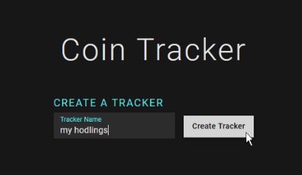
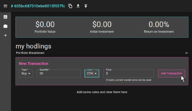
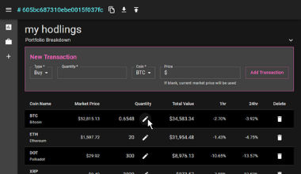
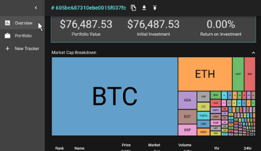

# Coin Tracker
###### *This is the front end repository. If you wish to view the API repository, you can find it [here](https://github.com/alicenstar/coin-tracker-3-api).*
***
#### Visit the site and create your own tracker [here](https://www.cointracker.me/), or view a demo tracker [here](https://www.cointracker.me/6046ee08e4fabe00153867e5).
***
### Purpose
Are you tired of having to log in to seven different exchanges just to see where your crypto portfolio stands? Me too. So, I created Coin Tracker, the site that tracks your cryptocurrency portfolio value anonymously - no login necessary.

### How does it work?
**Coin Tracker keeps track of your holdings by generating a unique URL that it associates with your personal portfolio.**

- When you first visit the site, you will be prompted to create a tracker, and then be redirected to your **Portfolio**. Once there, you'll want to bookmark the page so you can easily visit your portfolio in the future.

- In the app bar at the top, you'll be able to copy your URL, download your portfolio as a `.csv` file, or upload a new `.csv` file.

- From the **Portfolio** page, you can add, edit, or delete holdings and see a collapsible treemap of your holdings.

- You can view current market data for 500 coins on the **Overview** page.

 
 

## Development Features
- Designed fully responsive `d3.js` treemaps with tooltips to represent market data and portfolio holdings
- Applied React's `useContext` hook to manage global state
- Built custom `useInterval` hook using `useRef` and `useEffect` in order to manage API calls and update market data every 90 seconds
- Utilized `TypeScript` to add type safety
- Integrated `react-router` to handle navigation and site routing
- Implemented `Material-UI` components to add responsive styling
- Integrated `react-hook-form` with `Material-UI` controlled components to handle form validation and manage state of form data

## Potential Improvements
- Ability to view transaction history
- Additional graphs (store change in portfolio value over time)
- Add user authentication and account functionality in order to integrate with third party exchanges (users can pull their account data from multiple sources to one central place)